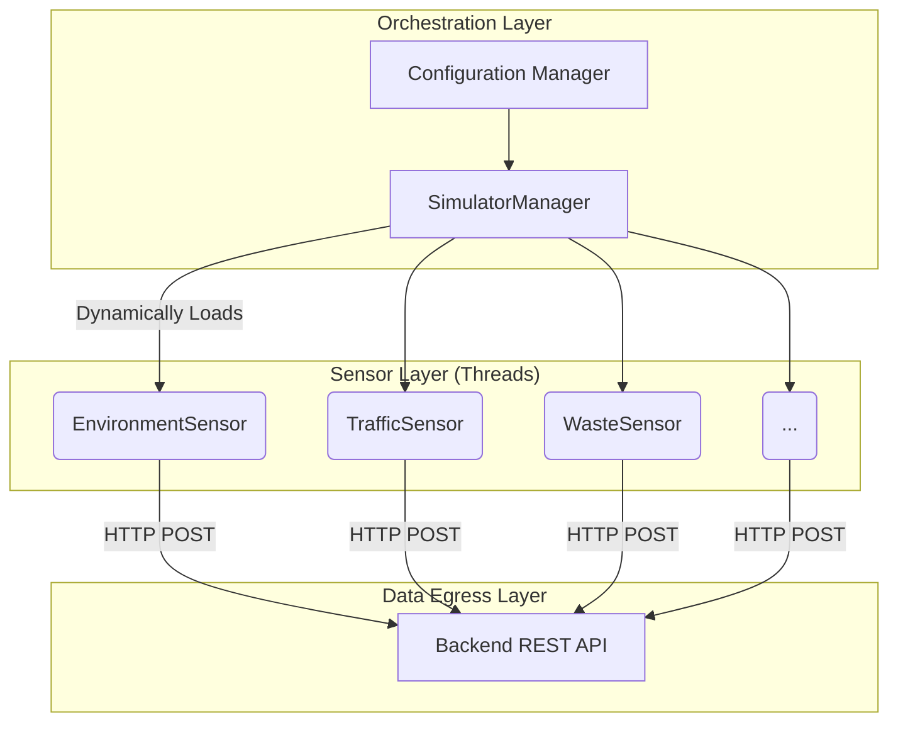

# Architecture Document: Smart City Simulator

This document provides a high-level overview of the Smart City Simulator architecture, data flow, and concurrency model.

## System Overview

The simulator generates high-fidelity telemetry simulating an urban environment. It bridges theoretical planning and practical engineering by modeling physical sensors and their interactions over time.

### High-Level Architecture

## Concurrency Model

### Threading Orchestration
- The `SimulatorManager` utilizes Python's `threading` module, initializing a separate daemon thread per sensor type.
- This creates non-blocking data generation pipelines matching realistic asynchronous city infrastructure.

### Desynchronization and Jitter
- **Thundering Herd Avoidance**: A jitter algorithm (`JITTER_PERCENTAGE`) randomly modifies the sleep duration (`SIMULATION_INTERVAL`) around a base value. This prevents simultaneous network spikes when polling the backend API, smoothing out traffic over time.

## Data Schema Hierarchy

- **Base Models (`models.py`)**: `BaseSensorData` implements common identifiers like `sensorId`, `city`, `zone` and `timestamp`.
- **Inheritance**: Specific sensors (e.g. `NoiseData`) inherit `BaseSensorData` and inject their specific attributes. This uses Pydantic's strict typing to prevent data drift and validation errors.

## Graceful Termination

- A `CancellationToken` object provides safe inter-thread communication.
- Instead of forceful kills (`sys.exit()`), threads monitor the token and handle exit cleanup operations, guaranteeing that no incomplete API requests are dropped.

## Advanced Sensor Simulation Models

- **Time-of-day Awareness**: Acoustic and Energy sensors model diurnal patterns.
- **Data Correlation**: AirQuality sensors dynamically correlate PM2.5 with PM10 values for statistical realism.

<!-- Updated block -->

<!-- API Gateway specs -->

### Accumulation Architecture
State machines dictate variables like Waste load to accumulate incrementally rather than generating chaotically.
