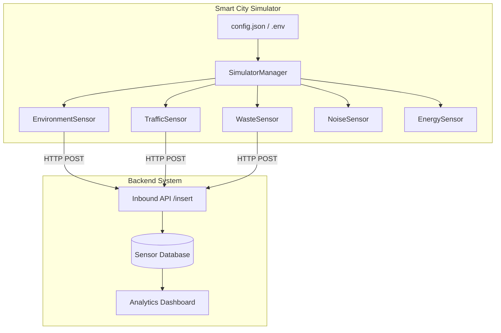

# Smart City Sensor Project Simulator

A distributed system simulator for smart city sensor data. This project simulates various types of sensors (Environment, Traffic, Waste) and sends their data to a centralized backend for processing and analysis.

## Architecture



## Features

- **Modular Design**: Class-based sensor implementation allows for easy expansion.
- **Configurable**: External `config.json`, `.env` variables, and CLI args.
- **Robustness**: Pydantic data validation and gracefull multi-threaded orchestrated execution.
- **Multiple Sensor Types**:
    - **Environment**: Temperature, Humidity, AQI, CO2.
    - **Traffic**: Vehicle count, Average Speed.
    - **Waste**: Fill levels, Collection status.
    - **Noise**: Acoustic decibel levels.
    - **Energy**: City power consumption in kW.

## Technical Specifications

### Data Schema

All sensors send data in JSON format with common and type-specific fields.

#### Common Fields (BaseSensor)
| Field | Type | Description |
| :--- | :--- | :--- |
| `sensorId` | `string` | Unique identifier for the sensor (e.g., S101) |
| `city` | `string` | City name (e.g., Mumbai) |
| `zone` | `string` | Specific area (e.g., Powai) |
| `timestamp` | `ISO8601` | Time of reading (e.g., 2024-03-08T10:00:00Z) |
| `type` | `string` | Sensor type (environment, traffic, waste) |

#### Type-Specific Fields
- **Environment**: `temperature`, `humidity`, `aqi`, `co2`
- **Traffic**: `vehicle_count`, `average_speed`
- **Waste**: `fill_level`, `last_collected`
- **Noise**: `decibels`
- **Energy**: `consumption_kw`

### API Specification

The simulator interacts with a backend REST API.

- **Endpoint**: `POST /insert`
- **Content-Type**: `application/json`
- **Payload**: Full sensor JSON object as described above.

## Future Scope
- **MQTT Integration**: Support for lightweight message queuing.
- **Predictive Analytics**: Integration with ML models for city trend forecasting.
- **Real-time Map**: Visual dashboard for sensor positions.

## Getting Started

1. **Install Dependencies**:
   ```bash
   pip install -r requirements.txt
   ```

2. **Configure**:
   Update `config.json` or copy `.env.example` to `.env` and set your backend URL and sensor details.

3. **Run Simulator**:
   ```bash
   # using python
   python simulator.py --config config.json
   
   # Using make
   make run
   ```
   
4. **Deploy with Docker**:
   ```bash
   make docker-build
   docker run smart-city-simulator
   ```

## Repository Statistics
- **Last Updated**: 2026-03-08
- **Language**: Python 3.x
