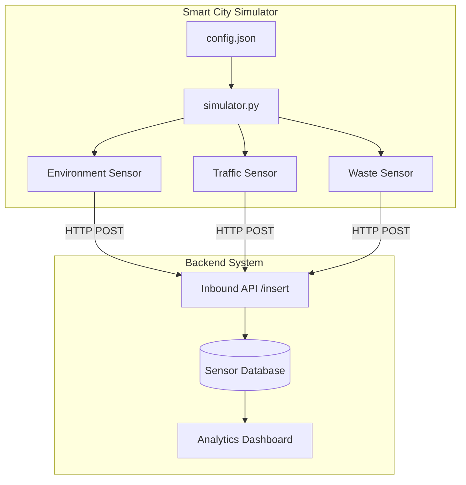

# Smart City Sensor Project Simulator

A distributed system simulator for smart city sensor data. This project simulates various types of sensors (Environment, Traffic, Waste) and sends their data to a centralized backend for processing and analysis.

## Architecture



## Features

- **Modular Design**: Class-based sensor implementation allows for easy expansion.
- **Configurable**: External `config.json` for managing backend URLs, IDs, and intervals.
- **Multiple Sensor Types**:
    - **Environment**: Temperature, Humidity, AQI, CO2.
    - **Traffic**: Vehicle count, Average Speed.
    - **Waste**: Fill levels, Collection status.

## Getting Started

1. **Install Dependencies**:
   ```bash
   pip install -r requirements.txt
   ```

2. **Configure**:
   Update `config.json` with your backend URL and sensor details.

3. **Run Simulator**:
   ```bash
   python simulator.py
   ```

## Repository Statistics
- **Last Updated**: 2026-03-08
- **Language**: Python 3.x
