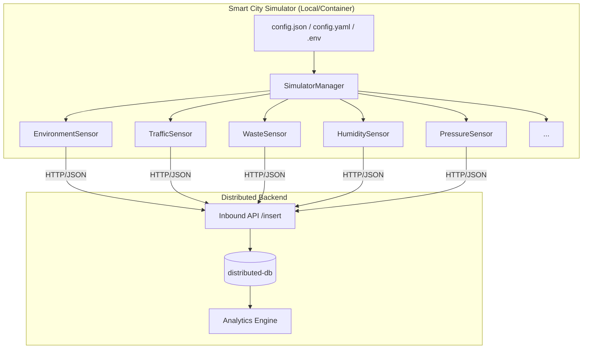

# 🏙️ Smart City Sensor Project Simulator

[](https://opensource.org/licenses/MIT)
[](https://www.python.org/downloads/)
[](https://github.com/psf/black)
[](https://github.com/SricharanAsr/Distributed-Systems-Smart-City-Sensor-Project-Simulator-/actions)

A high-fidelity, distributed system simulator for smart city sensor data. This project simulates diverse sensor types and orchestrates concurrent data transmission to a centralized Hbase/Backend system.

## 🏛️ Architecture



## 🚀 Overview

The **Smart City Sensor Project Simulator** is designed to emulate the complex telemetry patterns of a modern urban environment. It provides a robust, scalable framework for generating high-velocity data points across multiple domains, from traffic flow to atmospheric conditions.

### 🛠️ Tech Stack

*   **Runtime**: Python 3.10+
*   **Validation**: [Pydantic v2](https://docs.pydantic.dev/) for strict schema enforcement.
*   **Net**: [Requests](https://requests.readthedocs.io/) with persistent session pooling.
*   **Config**: Hierarchical loading (Env -> YAML -> JSON -> CLI).
*   **Concurrency**: Multi-threaded `ThreadPoolExecutor` for parallel sensor tasking.
*   **Ops**: Docker-ready with `Makefile` automation.

## 🧬 Core Features

*   **Dynamic Orchestration**: Each sensor operates on its own lifecycle managed by a central supervisor.
*   **Intelligent Jitter**: Implements randomized interval padding to simulate real-world transmission desynchronization.
*   **Graceful Termination**: Robust signal handling (`SIGINT`/`SIGTERM`) ensures clean exits and data integrity via the `CancellationToken` pattern.
*   **Local Resilience**: Built-in **Offline Persistence (Caching)** saves failed payloads locally when connectivity is lost.
*   **Observability**: Integrated **Rotating File Logging** and Optional JSON formatting for log aggregators.

## 📡 Sensor Catalog

| Sensor Type | Key Metrics Simulated | Application |
| :--- | :--- | :--- |
| **Traffic** | Vehicle Count, Speed, Congestion | Urban Mobility |
| **Air Quality** | PM2.5, PM10, CO2, NO2 | Environmental Health |
| **Waste** | Fill Level, Weight, Stateful Tracking | Logistics |
| **Humidity** | Relative Humidity, Dew Point | Micro-climate Monitoring |
| **Pressure** | Atmospheric Pressure, Equivalent Altitude | Meteorology |
| **Environment** | Temperature, Multi-factor analysis | General Weather |
| **Water Quality**| pH, Turbidity, Dissolved Oxygen | Utility Management |
| **Parking** | Occupancy, Turnover | Smart Infrastructure |

## 🛠️ Getting Started

### Prerequisites
* Python 3.10 or higher
* Docker (optional)

### Quick Start
1.  **Clone and Install**:
    ```bash
    git clone https://github.com/SricharanAsr/Distributed-Systems-Smart-City-Sensor-Project-Simulator-.git
    cd Distributed-Systems-Smart-City-Sensor-Project-Simulator-
    pip install -r requirements.txt
    ```

2.  **Run with Defaults (Dry-Run)**:
    ```bash
    python simulator.py --dry-run
    ```

3.  **Production Run**:
    ```bash
    python simulator.py --config config.yaml
    ```

### Using Makefile
*   `make run`: Start simulation.
*   `make health`: Perform connectivity and config check.
*   `make docker-build`: Containerize the application.

## 📊 Technical Data Model

Comprehensive schema documentation is available in [DOCS/DATA_MODEL.md](DOCS/DATA_MODEL.md).

## 📄 License
This project is licensed under the [MIT License](LICENSE).
